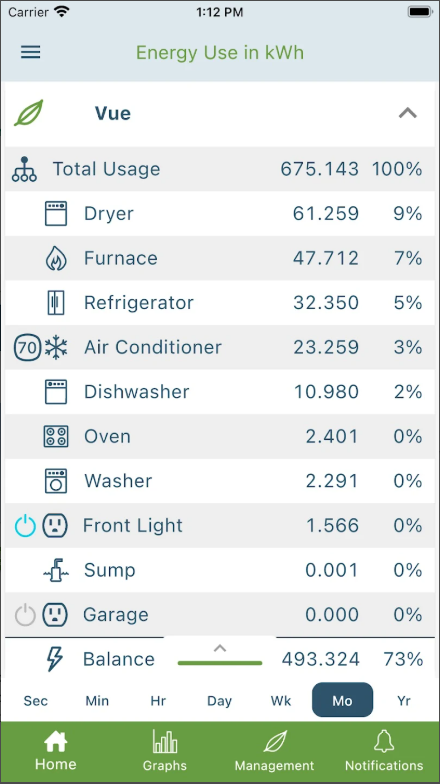
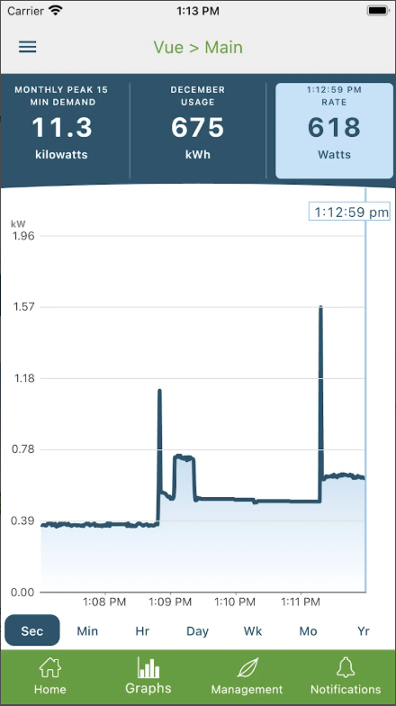
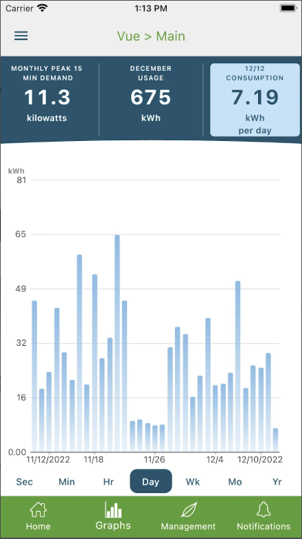
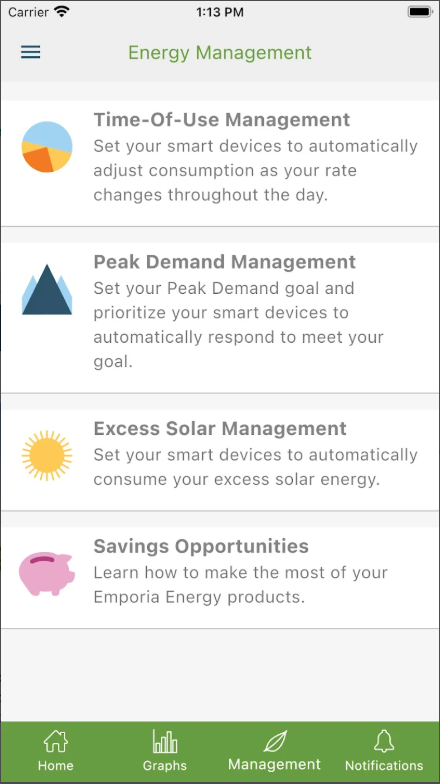
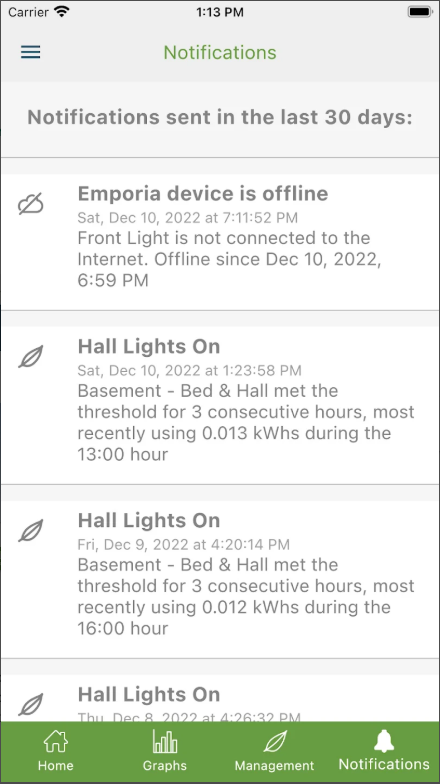
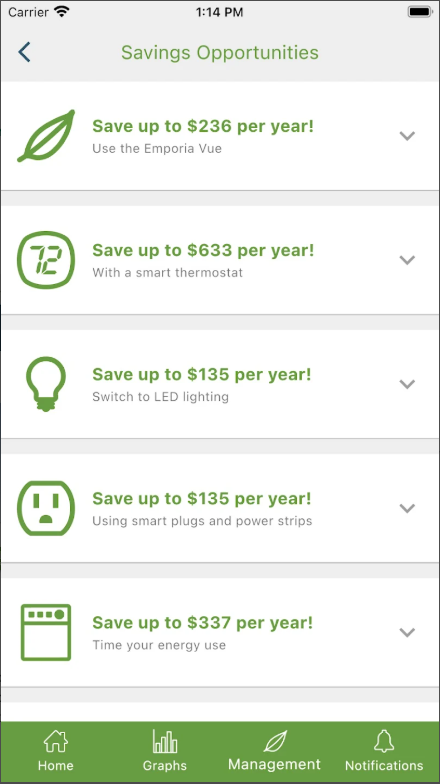
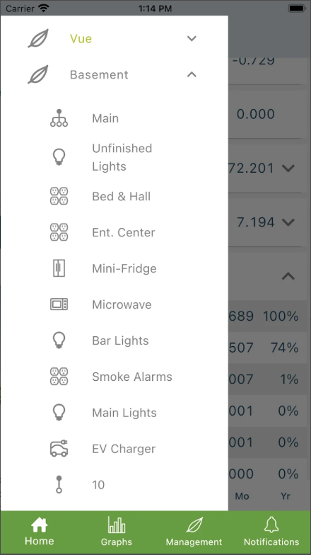
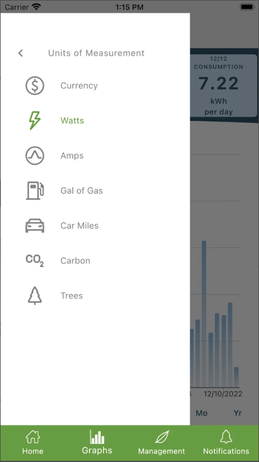

# Competitor Analysis: Emporia Energy  

## General Information  
- **Name of System:** Emporia Energy  
- **Company/Developer:** Emporia Energy Corp.  
- **Website/Product Page:** [https://www.emporiaenergy.com]  
- **Version/Release Date:** Varies by product; energy monitors launched around 2019.  
- **Platform(s) Supported:** Web, Mobile (iOS/Android)  
- **Target Audience:**  
  - Homeowners looking to monitor and reduce energy consumption.  
  - Users with solar panels who want to track production and usage.  
  - Electric vehicle owners needing efficient charging management.  

---

## Core Functionality  

### **Primary Purpose**  
Emporia Energy is a home energy monitoring system that provides real-time electricity usage tracking, helping users optimize consumption to reduce costs and waste.  

### **Key Features**  
- **Real-Time Energy Monitoring** → Tracks electricity consumption for the entire home and individual circuits using smart sensors.  
- **Solar Energy Integration** → Displays solar panel production and how the generated energy is used (self-consumption or grid export).  
- **Electric Vehicle Charging Management** → Schedules and optimizes EV charging to save costs.  
- **Alerts & Notifications** → Sends warnings about excessive energy usage and suggests savings opportunities.  
- **Historical Data & Analytics** → Provides detailed charts to track consumption trends over time.  

### **Unique Selling Points (USPs)**  
- **Circuit-Level Monitoring** → Unlike many competitors, it allows tracking of individual circuits separately.  
- **Affordable Pricing** → More cost-effective compared to solutions like Sense or Tesla Powerwall.  
- **Smart Device Integration** → Compatible with home automation systems and assistants like Alexa and Google Home.  

### **Limitations/Weaknesses**  
- **Confusing Interface** → The app presents too much data, which may be overwhelming for beginners.  
- **Requires Additional Hardware** → Extra sensors are needed for detailed monitoring of specific circuits.  
- **Learning Curve** → Users must manually identify circuits, which can be complex.  
- **No Remote Control** → The system monitors usage but does not allow remote control of devices.  

---

## Screenshots  

 

---

## Online Reviews  

📌 **Generally Positive** ⭐⭐⭐⭐☆  
- **Common Praises**  
  ✅ Provides detailed and accurate energy consumption insights.  
  ✅ Good integration with solar panels and EV charging.  
  ✅ More affordable than premium competitors.  

- **Common Criticisms**  
  ❌ Interface can be confusing for non-technical users.  
  ❌ Limited compatibility with certain solar panel brands.  
  ❌ Requires additional hardware for full circuit-level monitoring.  

---

## Conclusion  
Emporia Energy is a **great choice for home energy monitoring**, especially for users with solar panels and electric vehicles. However, **its interface could be more user-friendly, and the need for extra hardware may be a drawback for some users**.  

📢 **Opportunity for Improvement**: A system with **more intuitive data visualization and better integration with home automation** could provide a competitive advantage.  
