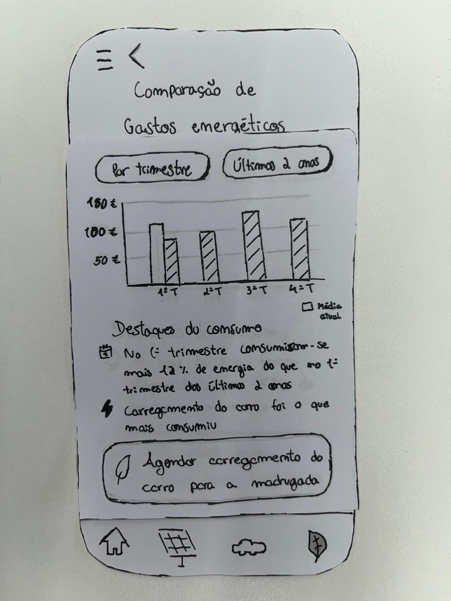

[Back to main Logbook Page](../hci_logbook.md)

---
# Low Fidelity Prototype and Evaluation

## D.1. Low Fidelity Prototype

### Task 1
  
*Descrição da imagem 1 da tarefa 1*

  
*Descrição da imagem 2 da tarefa 1*

  
*Descrição da imagem 3 da tarefa 1*

### Task 2
  
*Descrição da imagem 1 da tarefa 2*

  
*Descrição da imagem 2 da tarefa 2*

### Task 3
  
*Descrição da imagem 1 da tarefa 3*

  
*Descrição da imagem 2 da tarefa 3*

  
*Descrição da imagem 3 da tarefa 3*

  
*Descrição da imagem 4 da tarefa 3*

### Task 4
  
*Descrição da imagem 1 da tarefa 4*

  
*Descrição da imagem 2 da tarefa 4*

  
*Descrição da imagem 3 da tarefa 4*

### Task 5
  
*Descrição da imagem 1 da tarefa 5*

## D.2. Prototype Evaluation

---
[Back to main Logbook Page](../hci_logbook.md)

---